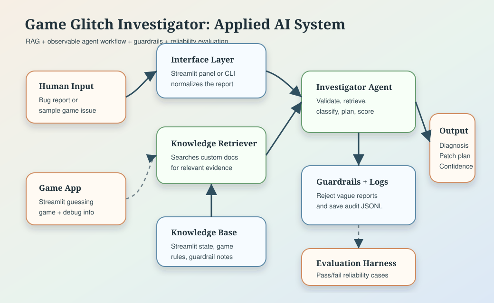

# Game Glitch Investigator: Applied AI System

Game Glitch Investigator started as my Module 1 debugging project: a Streamlit number guessing game with intentionally broken AI-generated logic. The original project focused on finding and fixing bugs such as swapped higher/lower hints, unstable Streamlit state, incorrect difficulty ranges, attempt-count errors, and inconsistent scoring.

This final version turns that debugging exercise into an applied AI system. In addition to the playable game, it now includes a retrieval-augmented bug investigator that reads a bug report, retrieves relevant project knowledge, classifies the likely failure mode, produces a patch plan, assigns confidence, and records an audit log.

## Architecture Overview



The system has two user interfaces: the Streamlit app and a command-line demo. A bug report flows into the investigator agent, which validates the input, retrieves evidence from the custom knowledge base in `knowledge_base/`, classifies the failure mode, and returns a diagnosis with a patch plan and confidence score. Reliability is handled through input guardrails, structured logs in `logs/investigations.jsonl`, unit tests, and the `evaluate_system.py` test harness.

## AI Features Added

- Retrieval-Augmented Generation style workflow: `retrieval.py` searches custom debugging documents before the investigator answers.
- Agentic workflow: `investigator.py` exposes intermediate steps for validate, retrieve, classify, plan, score, and log.
- Reliability guardrails: vague or unsafe-to-diagnose reports are rejected instead of producing fake certainty.
- Evaluation harness: `evaluate_system.py` runs predefined cases and prints pass/fail reliability results.

## Setup

1. Create and activate a virtual environment if desired.
2. Install dependencies:

```bash
pip install -r requirements.txt
```

3. Run the Streamlit app:

```bash
python -m streamlit run app.py
```

4. Run the CLI demo:

```bash
python investigator_cli.py --demo
```

5. Run tests and reliability evaluation:

```bash
pytest
python evaluate_system.py
```

## Sample Interactions

Input:

```text
When I click submit, the secret number changes and I can never win.
```

Output summary:

```text
Diagnosis: streamlit_state
Confidence: high
Patch plan: store secret, attempts, score, status, and history in st.session_state; initialize only when missing; reset related state together.
```

Input:

```text
The hint says go higher even when my guess is above the secret number.
```

Output summary:

```text
Diagnosis: hint_logic
Confidence: high
Patch plan: centralize comparison in check_guess; add too-high and too-low tests; avoid string comparison between numeric values.
```

Input:

```text
bad
```

Output summary:

```text
Diagnosis: needs_more_context
Guardrail: the report is too short to diagnose responsibly.
Patch plan: ask for visible behavior, expected behavior, and one example input.
```

## Design Decisions

I chose a deterministic retrieval and rules-based investigator instead of a hosted LLM API so the grader can run the project without credentials or network access. The trade-off is that the system is narrower than a general chatbot, but it is easier to inspect, test, and trust. The knowledge base is intentionally small and project-specific, which makes the retrieved evidence match the actual game implementation rather than generic debugging advice.

The Streamlit game remains the main artifact from the original project, while the investigator adds an AI-assisted debugging layer around it. This keeps the final project connected to the base assignment instead of becoming a disconnected standalone script.

## Testing Summary

The project includes two layers of tests. `tests/test_game_logic.py` verifies the fixed game behavior: hint logic, scoring, parsing, range validation, attempt limits, difficulty ranges, and high-score persistence. `tests/test_investigator.py` verifies that the knowledge base loads, retrieval returns evidence, the investigator classifies known bug reports, guardrails trigger for vague reports, and audit logs are written.

The reliability harness runs six predefined bug-report cases. It checks whether the investigator returns the expected category and meets a minimum confidence threshold. This provides a simple, repeatable way to show that the AI feature behaves consistently across common failure modes.

## Reflection and Ethics

The system is limited by its knowledge base and classification rules. It can diagnose bugs similar to the original game issues, but it should not be treated as a general software-debugging assistant. If the report is too vague, the guardrail intentionally asks for more context instead of inventing a confident answer.

The main misuse risk is over-trusting the diagnosis and applying a patch without reproducing the bug. To reduce that risk, the system shows confidence, retrieved sources, intermediate steps, and recommended tests. The most surprising reliability finding was that vague inputs are common, and refusing to diagnose them is more responsible than trying to sound helpful.

During development, AI was helpful when it suggested separating Streamlit state bugs from pure game-logic bugs, because that led to cleaner tests and a better architecture. One flawed AI suggestion was treating a UI display-lag issue as if it could be fixed only by moving widgets; that created a risk of unstable Streamlit layout behavior. The better fix was to keep widgets stable and update visible values through placeholders.

## Demo Walkthrough

Loom link: `<add Loom walkthrough link here before submission>`

The video should show the Streamlit game, two or three investigator inputs, one guardrail case, and the reliability evaluation command.
